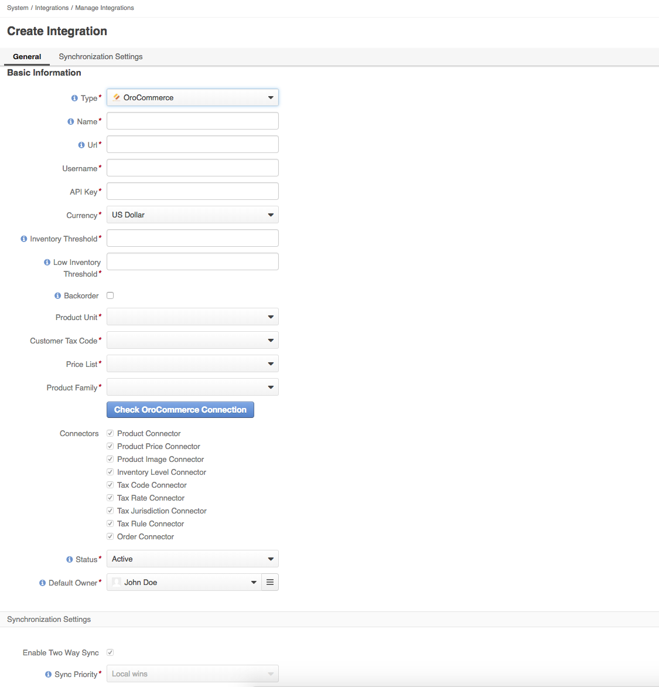
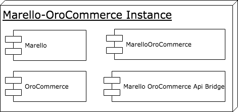

Marello OroCommerce Bridge
========================

Package that contains bundles related to the integration between Marello and OroCommerce
Marello (Enterprise) contains the possibility to integrate with the B2B Commerce platform OroCommerce. This integration allows business owners to use their OroCommerce online store as a SalesChannel in Marello (Enterprise).

Requirements
------------

Marello OroCommerce Bridge requires Marello CE 1.3.* or Marello EE 1.1.* and OroCommerce (EE) 1.5.* installed in order to function correctly. 

Terminology
------------

|Term | Explanation |
|-----|-------------|
|Single Instance|Single instance refers to the setup in which Marello and OroCommerce are installed together on the same server using the same code base and database|
|Multiple Instances|Multiple instances referes to the setup in which Marello and OroCommerce are installed on separate servers where they are not sharing the same code base and database|

General information
------------

The integration between Marello (Enterprise) and OroCommerce can be setup in either a single (Marello and OroCommerce installed together) or multiple instances (Marello and OroCommerce are installed on separate servers). Both setups are currently supported. The integration is using the OroCommerce API in order to perform synchronisations between the two systems which allows us to use both setups with a single solution. 

The integration will allow business owners to synchronise:

* Orders;
* Products;
* Product Images;
* Product Prices;
* Inventory;
* and Tax related entities such as TaxRules, TaxCodes and Tax Jurisdictions

Configuration
------------
In order to configure the integration, make sure you have setup the applications correctly. Please advice with your implementation partner to verify your setup, or see the technical overview below.

### Configuration prerequisites
* A user which has an API key generated (https://oroinc.com/orocrm/doc/current/dev-guide/cookbook/how-to-use-wsse-authentication#api-key); 
* A user which has permissions to create, update and view Products, Product Prices, Inventory and Tax related entities (TaxRules, TaxCodes and Tax Jurisdictions) (https://oroinc.com/orocrm/doc/2.3/admin-guide/security/access-management-roles#action-on-entity-permissions);
* A user which has permissions to view and update Orders (https://oroinc.com/orocrm/doc/2.3/admin-guide/security/access-management-roles#action-on-entity-permissions)

__Above prerequisites should be met before configuring your integration in Marello.__

### Integration Configuration
The configuration for the integration should be done in the Marello Application. __If the setup is done with multiple instances, this is especially important!__
The integration can be created on the 'Integration' page and can be found in Marello in:
* _System → Integrations → Manage Integrations → Create Integration._

The page will show you the following information for you to configure the Integration:

|Configuration Option | Explanation	| Example |
|---------------------|-------------|---------|
|Name|Name of the Integration and SalesChannel*|OroCommerce Channel|
|URL|URL where the integration can connect to. This should be the admin URL of your OroCommerce application|http://example.com/admin|
|Username|Username of the User which has API access to the OroCommerce application|admin|
|Api Key|Generated API Key for the User in the OroCommerce application |2443a16dd3110b73b8cd97da26c6d4cb4c1124df|
|Currency|Currency which is used in the OroCommerce application**. The currency value is also being used for the creation of a new SalesChannel based of the integration configuration.|EUR, USD|
|Inventory Threshold|The value that defines the limit of inventory after which this product can not be ordered|10|
|Low Inventory Threshold|The minimum inventory level defined for the product. Reaching the defined level will trigger a warning message to the buyer in the front store.|5|
|Backorder|Backorder flag defines whether a product may be ordered while not in stock or when the inventory is low. When such product is ordered, the shipment will happen once the product is restocked.|Yes/No|
|Product Unit|Product Unit used to create a Product in OroCommerce. These values will be the available units from the OroCommerce application.	|each, items|
|Customer Tax Code|Tax Code to be used for customers. Values will be the available Customer Tax Codes from the OroCommerce application.|NON_EXEMPT|
|Price List|Price List used to assign a newly created product to. Price List values will be the available price lists from OroCommerce application	|Default Price List|
|Product Family|Product Family used to create new products in OroCommerce. Product Family values will be the available Product Families from OroCommerce application|Default|

_*The configured name of the integration will be used to create a SalesChannel with the same name and code. In order to synchronise to be able to only synchronise selected products to the OroCommerce SalesChannel, products need to be assigned to the OroCommerce SalesChannel and therefore a new SalesChannel is created with the same name and code as the integration._

_**Only a single currency is supported per integration. The value is also being used for the creation of the SalesChannel._

#####A few notes about the integration and events happening.
* After the integration is saved, a new SalesChannel will be created based on this integration;
* Every product which will be assigned to this SalesChannel will be synchronised to OroCommerce (only if the balanced inventory is greater than 0)
* When a TaxRule,TaxRate,TaxCode or TaxJurisdiction is created, updated or deleted products assigned to this SalesChannel, will be trigger synchronisation of all products assigned to this SalesChannel (so it is recommended to fill correct tax information before assigning products to SalesChannel based on the integration);
* Order import will be done only, for products which exists on Marello side, orders with products that do not exist in Marello will be skipped;
* Order status will be exported to OroCommerce when the order is going through the workflow in Marello.

Technical overview
------------
This part of the documentation will cover the setup of both a single instance and multiple instance setup of the integration with OroCommerce. It will describe the (required) components needed in order to make the single and or multiple instance setup work correctly.

###Components
In order to create a successful integration between Marello and OroCommerce, there are at least two additional components necessary next to Marello and OroCommerce to create the Integration. 

####MarelloOroCommerce Bridge and Bundle
The MarelloOroCommerce Bridge and Bundle will provide you with the integration and services need in order to create an integration. This package does not include the extension of the OroCommerce API and or disabling of the Order notification emails.

This package will provide you with the code in order to create the integration, cleanup and clarification of the Admin Navigation and clarification of the widgets in the Admin Dashboard.

####MarelloOroCommerce Api Bridge
This Bridge will provide you with the necessary code and configuration to extend the current OroCommerce (1.5.x)  API endpoints in order to facilitate Tax related entity creation, updating the Order and Payment status of entities in OroCommerce. Another feature this api bridge will provide is the disabling of the Order notification emails being send through OroCommerce since this responsibility will be handled by Marello. Without this component the Integration will not work properly and will leave you in disappointment.

#####Single Instance Setup
A single instance setup would be a setup where all the required components and applications are installed together on the same server while sharing the code base and database. Even though they are being installed together, the integration still operates through API calls on OroCommerce, meaning the url (admin url) needed to configure will be the same as where the application is actually running on. The diagram below shows a setup of the Marello-OroCommerce integration as a single instance setup.

The single instance setup will share a repository and we've configured a repository to do exact that. The public repository will only feature the Community Editions of Marello and OroCommerce without the CRM. However it is possible to install OroCRM Community edition with the setup, but does require additional dependencies. The repository can be found at https://github.com/marellocommerce/marello-orocommerce.

#####Multiple Instance Setup
If Marello and OroCommerce are not installed together in a single application; we are talking about a multi instance setup where the applications are not sharing the same code base and database. The integration can coop with a multi instance setup since the integration is communicating via the API of OroCommerce, whether it's installed together or apart from each other. The multi instance setup will look something like the diagram below from a high level perspective. The respective components needed for the integration have been drawn in the instance where they should be installed.

The diagram above shows us that the MarelloOroCommerce Bridge and Bundle compontent are being installed to the Marello Application as this enables the business owner to configure an integration with OroCommerce. It also shows that the MarelloOroCommerce API Bridge component should be installed in the OroCommerce Application as this component will extend the current OroCommerce API and disabling the Order notification emails in the OroCommerce application.

The multi instance setup will not have a pre-configured repository since it depends on the repositories at hand or configuration handled by the (technical) implementation partner.
